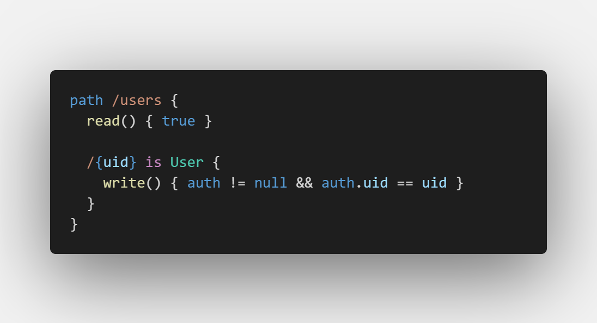

Syntax highlighting for [the Bolt compiler](https://firebase.com/docs/security/bolt/quickstart.html) for Visual Studio Code.

## Syntax in Action

Inspired by [David East's sublime package](https://github.com/davideast/bolt-sublime)
