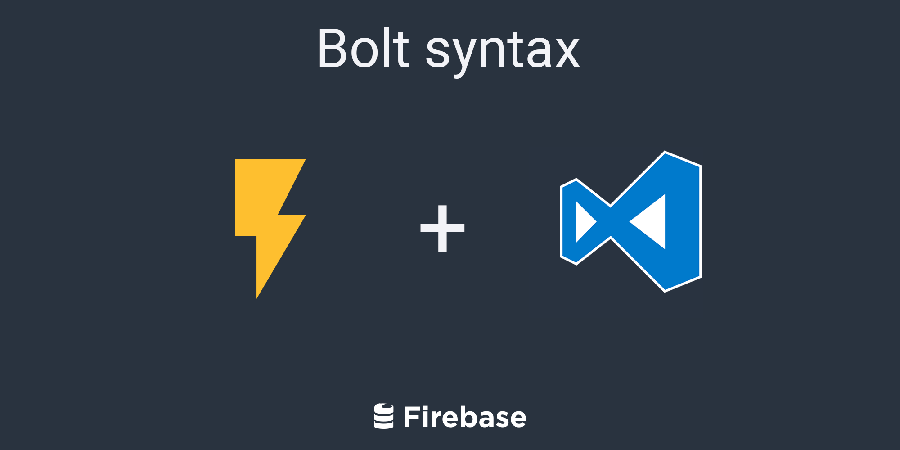

  

<h3 align="center">Syntax highlighting of <a href="https://firebase.com/docs/security/bolt/quickstart.html">Bolt compiler</a> for Visual Studio Code.</h3>
 
 

  
  
  
  
  

 

  <a href="https://github.com/smkamranqadri/vscode-bolt-language/issues">Report Bug</a> - <a href="https://github.com/smkamranqadri/vscode-bolt-language/issues">Request Feature</a>

 

## Syntax in Action

### Contributors

## Inspired By

- The sublime package by David East's which can be [found here](https://github.com/davideast/bolt-sublime).

## Thanks To

- [Patrick McDonald](https://github.com/WhatsThatItsPat) for hero image.
- [Jason Maa](https://github.com/jasmaa) for the new and improved syntax code for language file also checkout his article about the motivation and journey [here](https://jasmaa.github.io/2020/03/29/vscode-bolt.html).

## Changelog

See [Changelog](CHANGELOG.md) for a human-readable history of changes.

## License

Distributed under the MIT License. See [LICENSE](LICENSE) for more information.
